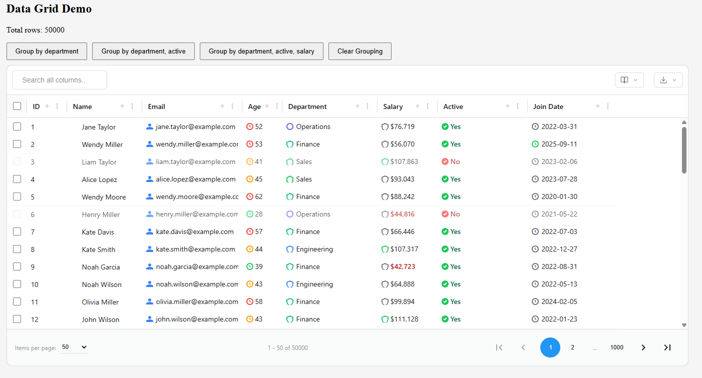

# Angular Data Grid

<div align="center">



**A powerful, feature-rich data grid component for Angular 19+**

[](https://opensource.org/licenses/MIT)
[](https://angular.io/)
[](https://www.typescriptlang.org/)

**Author:** Chakravarthi Chennu

</div>

---

## Table of Contents

- [Overview](#overview)
- [Features](#features)
- [Installation](#installation)
- [Quick Start](#quick-start)
- [Detailed Feature Guide](#detailed-feature-guide)
  - [Sorting](#1-sorting)
  - [Filtering](#2-filtering)
  - [Pagination](#3-pagination)
  - [Grouping](#4-grouping)
  - [Row Selection](#5-row-selection)
  - [Cell Editing](#6-cell-editing)
  - [Column Resizing](#7-column-resizing)
  - [Column Visibility](#8-column-visibility)
  - [Global Search](#9-global-search)
  - [Context Menu](#10-context-menu)
  - [Data Export](#11-data-export)
  - [Row Action Buttons](#12-row-action-buttons)
  - [Custom Cell Renderers](#13-custom-cell-renderers)
  - [Cell Icons](#14-cell-icons)
  - [Custom Row/Cell Classes](#15-custom-rowcell-classes)
  - [Virtual Scrolling](#16-virtual-scrolling)
- [Column Definition API](#column-definition-api)
- [Component API Reference](#component-api-reference)
- [Examples](#examples)
- [Performance](#performance)
- [Development](#development)
- [Browser Support](#browser-support)
- [License](#license)
- [Contributing](#contributing)
- [Support](#support)

---

## Overview

Angular Data Grid is a comprehensive, enterprise-grade data grid component built specifically for Angular 19+. It provides a rich set of features for displaying, manipulating, and interacting with tabular data. The grid is designed with performance in mind, using virtual scrolling to handle large datasets efficiently.

### Key Highlights

- 🚀 **High Performance** - Virtual scrolling for handling thousands of rows
- 🎨 **Fully Customizable** - Extensive theming and styling options
- 📱 **Responsive** - Works seamlessly across all screen sizes
- 🔧 **Type-Safe** - Built with TypeScript for better developer experience
- ♿ **Accessible** - Keyboard navigation and ARIA support
- 📦 **Lightweight** - Minimal dependencies, optimized bundle size

---

## Features

- ✅ **Sorting** - Multi-column sorting with visual indicators
- ✅ **Filtering** - Column-level filtering with multiple operators
- ✅ **Pagination** - Built-in pagination with customizable page sizes
- ✅ **Grouping** - Row grouping with expand/collapse functionality
- ✅ **Cell Editing** - Inline cell editing with validation
- ✅ **Row Selection** - Single and multiple row selection with checkboxes
- ✅ **Column Resizing** - Drag-to-resize columns
- ✅ **Column Visibility** - Show/hide columns dynamically
- ✅ **Virtual Scrolling** - Efficient rendering of large datasets
- ✅ **Custom Cell Renderers** - Render custom HTML/icons in cells
- ✅ **Cell Icons** - Add icons to cells with positioning options
- ✅ **Conditional Row Selection** - Disable selection for specific rows
- ✅ **Custom Row/Cell Classes** - Dynamic CSS classes based on data
- ✅ **Cell Click Callbacks** - Handle cell click events
- ✅ **Context Menu** - Right-click context menu for cells
- ✅ **Global Search** - Search across all filterable columns
- ✅ **Data Export** - Export to XLSX, CSV, and JSON formats
- ✅ **Row Actions** - Dynamic action buttons for selected rows
- ✅ **Theme Support** - Light and dark themes

---

## Installation

```bash
npm install @your-org/data-grid
# or
pnpm install @your-org/data-grid
# or
yarn add @your-org/data-grid
```

### Peer Dependencies

The grid requires the following peer dependencies:

- `@angular/core`: ^19.0.0
- `@angular/common`: ^19.0.0
- `@angular/forms`: ^19.0.0
- `rxjs`: ^7.0.0

---

## Quick Start

### 1. Import the Component

Since the component is standalone, you can import it directly:

```typescript
import { DataGridComponent } from "@your-org/data-grid";

@Component({
  standalone: true,
  imports: [DataGridComponent],
  // ...
})
export class MyComponent {}
```

### 2. Define Your Data Interface

```typescript
interface Employee {
  id: number;
  name: string;
  email: string;
  age: number;
  department: string;
  salary: number;
  active: boolean;
  joinDate: string;
}
```

### 3. Define Columns

```typescript
import { ColumnDefinition } from '@your-org/data-grid';

columns: ColumnDefinition<Employee>[] = [
  {
    id: 'id',
    field: 'id',
    headerName: 'ID',
    width: 80,
    sortable: true,
  },
  {
    id: 'name',
    field: 'name',
    headerName: 'Name',
    width: 150,
    sortable: true,
    filterable: true,
  },
  {
    id: 'email',
    field: 'email',
    headerName: 'Email',
    width: 200,
    sortable: true,
    filterable: true,
  },
  {
    id: 'department',
    field: 'department',
    headerName: 'Department',
    width: 150,
    enableRowGroup: true, // Allow grouping by this column
  },
  {
    id: 'salary',
    field: 'salary',
    headerName: 'Salary',
    width: 120,
    sortable: true,
    type: 'number',
  },
];
```

### 4. Use in Template

```html
<data-grid
  [columns]="columns"
  [rowData]="employees"
  [enableSorting]="true"
  [enableFiltering]="true"
  [enablePagination]="true"
  [pageSize]="50"
  [enableSelection]="true"
  [enableGrouping]="true"
  (selectionChanged)="onSelectionChanged($event)"
></data-grid>
```

---

## Detailed Feature Guide

### 1. Sorting

Enable column sorting to allow users to sort data by clicking column headers.

#### Basic Usage

```typescript
columns: ColumnDefinition<Employee>[] = [
  {
    id: 'name',
    field: 'name',
    headerName: 'Name',
    sortable: true, // Enable sorting
  },
];
```

```html
<data-grid
  [columns]="columns"
  [rowData]="data"
  [enableSorting]="true"
  (sortChanged)="onSortChanged($event)"
></data-grid>
```

#### Handling Sort Events

```typescript
onSortChanged(event: { columnId: string; direction: SortDirection }): void {
  console.log(`Sorting by ${event.columnId} in ${event.direction} direction`);
  // SortDirection can be 'asc', 'desc', or null
}
```

#### Visual Indicators

When a column is sorted, a small dot indicator appears in the top-right corner of the header cell. The indicator shows:

- **Active dot** - Column is currently sorted
- **No dot** - Column is not sorted

### 2. Filtering

Enable column-level filtering with multiple filter operators.

#### Basic Usage

```typescript
columns: ColumnDefinition<Employee>[] = [
  {
    id: 'name',
    field: 'name',
    headerName: 'Name',
    filterable: true, // Enable filtering
  },
  {
    id: 'salary',
    field: 'salary',
    headerName: 'Salary',
    filterable: true,
    type: 'number', // Helps with number filtering
  },
];
```

```html
<data-grid
  [columns]="columns"
  [rowData]="data"
  [enableFiltering]="true"
  (filterChanged)="onFilterChanged($event)"
></data-grid>
```

#### Filter Operators

The grid supports the following filter operators:

- **equals** - Exact match
- **notEquals** - Not equal
- **contains** - Contains substring (for strings)
- **notContains** - Does not contain substring
- **startsWith** - Starts with substring
- **endsWith** - Ends with substring
- **greaterThan** - Greater than (for numbers/dates)
- **lessThan** - Less than (for numbers/dates)
- **greaterThanOrEqual** - Greater than or equal
- **lessThanOrEqual** - Less than or equal

#### Handling Filter Events

```typescript
onFilterChanged(event: {
  columnId: string;
  condition: FilterCondition | null
}): void {
  if (event.condition) {
    console.log(`Filtering ${event.columnId} with:`, event.condition);
    // event.condition.operator - The filter operator
    // event.condition.value - The filter value
  } else {
    console.log(`Filter cleared for ${event.columnId}`);
  }
}
```

#### Accessing Filter Menu

Click the filter icon (three horizontal lines) in the column header to open the filter menu. The menu allows you to:

- Select a filter operator
- Enter a filter value
- Apply or clear the filter

### 3. Pagination

Enable pagination to split large datasets into manageable pages.

#### Basic Usage

```html
<data-grid
  [columns]="columns"
  [rowData]="data"
  [enablePagination]="true"
  [pageSize]="50"
  (pageChanged)="onPageChanged($event)"
  (pageSizeChanged)="onPageSizeChanged($event)"
></data-grid>
```

#### Configuration Options

- **enablePagination** - Enable/disable pagination (default: `false`)
- **pageSize** - Number of rows per page (default: `100`)

#### Handling Pagination Events

```typescript
onPageChanged(page: number): void {
  console.log(`Page changed to: ${page}`);
  // Load data for the new page if needed
}

onPageSizeChanged(pageSize: number): void {
  console.log(`Page size changed to: ${pageSize}`);
  // Update your data source
}
```

#### Pagination Controls

The grid displays pagination controls at the bottom showing:

- Current page number
- Total number of pages
- Items per page dropdown
- Navigation buttons (First, Previous, Next, Last)

### 4. Grouping

Enable row grouping to organize data by column values.

#### Basic Usage

```typescript
columns: ColumnDefinition<Employee>[] = [
  {
    id: 'department',
    field: 'department',
    headerName: 'Department',
    enableRowGroup: true, // Allow grouping by this column
  },
];
```

```html
<data-grid
  [columns]="columns"
  [rowData]="data"
  [enableGrouping]="true"
  (groupingChanged)="onGroupingChanged($event)"
  (groupToggled)="onGroupToggled($event)"
></data-grid>
```

#### How to Group

1. Click the menu button (three dots) in a column header
2. Select "Row Group" from the menu
3. The grid will automatically group rows by that column's values

#### Group Row Display

Group rows display:

- **Group label** - Shows "Column Name: Value" (e.g., "Department: Finance")
- **Row count** - Number of rows in the group (e.g., "(8358)")
- **Toggle button** - Expand/collapse the group

#### Group Column

When grouping is active, a special group column appears on the left side of the grid. This column:

- Has a default width of 200px (customizable)
- Can be resized like other columns
- Shows the group hierarchy

#### Handling Group Events

```typescript
onGroupingChanged(columnIds: string[]): void {
  console.log('Grouping changed:', columnIds);
  // columnIds - Array of column IDs that are currently grouped
}

onGroupToggled(event: { groupKey: string; expanded: boolean }): void {
  console.log(`Group ${event.groupKey} is now ${event.expanded ? 'expanded' : 'collapsed'}`);
}
```

### 5. Row Selection

Enable row selection with checkboxes for single or multiple row selection.

#### Basic Usage

```html
<data-grid
  [columns]="columns"
  [rowData]="data"
  [enableSelection]="true"
  [selectionType]="'multiple'"
  (selectionChanged)="onSelectionChanged($event)"
></data-grid>
```

#### Selection Types

- **single** - Only one row can be selected at a time
- **multiple** - Multiple rows can be selected (default)

#### Conditional Selection

Disable selection for specific rows:

```typescript
isRowSelectable = (row: Employee, index: number): boolean => {
  // Only allow selection of active employees
  return row.active === true;
};
```

```html
<data-grid
  [columns]="columns"
  [rowData]="data"
  [enableSelection]="true"
  [isRowSelectable]="isRowSelectable"
></data-grid>
```

#### Handling Selection Events

```typescript
onSelectionChanged(selectedRows: Employee[]): void {
  console.log('Selected rows:', selectedRows);
  // selectedRows - Array of selected row data objects
}
```

#### Select All Checkbox

When `selectionType` is `'multiple'`, a "Select All" checkbox appears in the header. Clicking it selects/deselects all rows on the current page.

#### Selection Actions

When rows are selected, action buttons appear above the grid. Configure these buttons using `rowActionButtons`:

```typescript
rowActionButtons: RowActionButton[] = [
  {
    id: 'copy',
    label: 'Copy',
    icon: '<svg>...</svg>',
    title: 'Copy selected rows',
  },
  {
    id: 'delete',
    label: 'Delete',
    icon: '<svg>...</svg>',
    title: 'Delete selected rows',
    class: 'delete',
  },
];
```

```html
<data-grid
  [columns]="columns"
  [rowData]="data"
  [enableSelection]="true"
  [rowActionButtons]="rowActionButtons"
  (selectionAction)="onSelectionAction($event)"
></data-grid>
```

```typescript
onSelectionAction(event: { action: string; selectedRows: Employee[] }): void {
  switch (event.action) {
    case 'copy':
      // Handle copy
      break;
    case 'delete':
      // Handle delete
      break;
  }
}
```

### 6. Cell Editing

Enable inline cell editing for editable columns.

#### Basic Usage

```typescript
columns: ColumnDefinition<Employee>[] = [
  {
    id: 'name',
    field: 'name',
    headerName: 'Name',
    editable: true, // Enable editing
  },
];
```

```html
<data-grid
  [columns]="columns"
  [rowData]="data"
  [enableCellEditing]="true"
  (cellValueChanged)="onCellValueChanged($event)"
></data-grid>
```

#### How to Edit

1. Double-click on an editable cell
2. The cell becomes an input field
3. Make your changes
4. Press Enter to save or Escape to cancel

#### Handling Edit Events

```typescript
onCellValueChanged(event: {
  rowIndex: number;
  columnId: string;
  value: unknown;
  row: Employee;
}): void {
  console.log(`Cell edited:`, event);
  // Update your data source
  // event.value - The new value
  // event.row - The complete row data
}
```

#### Value Setters

Use a custom value setter to transform the value before saving:

```typescript
{
  id: 'salary',
  field: 'salary',
  headerName: 'Salary',
  editable: true,
  valueSetter: (row: Employee, value: any) => {
    // Transform the value (e.g., remove currency symbols)
    const numericValue = parseFloat(value.toString().replace(/[^0-9.-]+/g, ''));
    return { ...row, salary: numericValue };
  },
}
```

### 7. Column Resizing

Enable column resizing to allow users to adjust column widths.

#### Basic Usage

```html
<data-grid
  [columns]="columns"
  [rowData]="data"
  [enableColumnResize]="true"
></data-grid>
```

#### Column Width Configuration

```typescript
columns: ColumnDefinition<Employee>[] = [
  {
    id: 'name',
    field: 'name',
    headerName: 'Name',
    width: 150, // Initial width
    minWidth: 100, // Minimum width
    maxWidth: 300, // Maximum width
    resizable: true, // Enable resizing (default: true)
  },
];
```

#### How to Resize

1. Hover over the right edge of a column header
2. The cursor changes to a resize cursor
3. Click and drag to resize
4. Release to set the new width

#### Flex Columns

Use flex to make columns fill available space:

```typescript
{
  id: 'description',
  field: 'description',
  headerName: 'Description',
  flex: 1, // Takes up remaining space
  minWidth: 200,
}
```

### 8. Column Visibility

Allow users to show/hide columns dynamically using the column visibility menu.

#### Basic Usage

The column visibility menu is automatically available. Users can:

1. Click the column visibility button (columns icon) in the toolbar
2. Check/uncheck columns to show/hide them
3. The menu closes automatically when clicking outside

#### Programmatic Control

Columns have a `visible` property that can be controlled programmatically:

```typescript
// Hide a column
const column = this.columns.find((col) => col.id === "salary");
if (column) {
  column.visible = false;
}
```

### 9. Global Search

Enable global search to filter across all filterable columns simultaneously.

#### Basic Usage

```html
<data-grid
  [columns]="columns"
  [rowData]="data"
  [enableGlobalSearch]="true"
  [globalSearchPlaceholder]="'Search all columns...'"
  [globalSearchPosition]="'left'"
></data-grid>
```

#### Configuration Options

- **enableGlobalSearch** - Enable/disable global search (default: `false`)
- **globalSearchPlaceholder** - Placeholder text (default: `'Search...'`)
- **globalSearchPosition** - Position: `'left'` or `'right'` (default: `'left'`)

#### How It Works

The global search:

- Searches across all columns that have `filterable: true`
- Applies a "contains" filter to matching columns
- Updates in real-time as you type
- Can be cleared using the clear button (X icon)

### 10. Context Menu

Right-click on any cell to access context menu options.

#### Available Actions

- **Copy** - Copy cell value to clipboard
- **Cut** - Cut cell value to clipboard
- **Paste** - Paste from clipboard to cell
- **Delete** - Clear cell value
- **Export** - Export cell data

#### Handling Context Menu Events

```html
<data-grid
  [columns]="columns"
  [rowData]="data"
  (cellContextMenu)="onCellContextMenu($event)"
></data-grid>
```

```typescript
onCellContextMenu(event: {
  row: Employee;
  column: ColumnDefinition<Employee>;
  value: any;
  action: string;
}): void {
  console.log('Context menu action:', event.action);
  console.log('Cell value:', event.value);
  // Handle the action
}
```

### 11. Data Export

Export grid data to various formats.

#### Available Formats

- **XLSX** - Excel format (.xlsx)
- **CSV** - Comma-separated values (.csv)
- **JSON** - JSON format (.json)

#### How to Export

1. Click the export button (download icon) in the toolbar
2. Select the desired format from the dropdown
3. The file will be downloaded automatically

#### Export All Data

The export function exports all data in the grid, including:

- All visible columns
- All rows (respecting current filters)
- Column headers as the first row

### 12. Row Action Buttons

Configure dynamic action buttons that appear when rows are selected.

#### Configuration

```typescript
import { RowActionButton } from '@your-org/data-grid';

rowActionButtons: RowActionButton[] = [
  {
    id: 'copy',
    label: 'Copy',
    icon: `<svg xmlns="http://www.w3.org/2000/svg" width="16" height="16" viewBox="0 0 24 24" fill="none" stroke="currentColor" stroke-width="2">
      <rect width="14" height="14" x="8" y="8" rx="2" ry="2"/>
      <path d="M4 16c-1.1 0-2-.9-2-2V6c0-1.1.9-2 2-2h8c1.1 0 2 .9 2 2"/>
    </svg>`,
    title: 'Copy selected rows',
  },
  {
    id: 'export',
    label: 'Export',
    icon: `<svg xmlns="http://www.w3.org/2000/svg" width="16" height="16" viewBox="0 0 24 24" fill="none" stroke="currentColor" stroke-width="2">
      <path d="M21 15v4a2 2 0 0 1-2 2H5a2 2 0 0 1-2-2v-4"/>
      <polyline points="7 10 12 15 17 10"/>
      <line x1="12" x2="12" y1="15" y2="3"/>
    </svg>`,
    title: 'Export selected rows',
  },
  {
    id: 'delete',
    label: 'Delete',
    icon: `<svg xmlns="http://www.w3.org/2000/svg" width="16" height="16" viewBox="0 0 24 24" fill="none" stroke="currentColor" stroke-width="2">
      <path d="M3 6h18"/>
      <path d="M19 6v14c0 1-1 2-2 2H7c-1 0-2-1-2-2V6"/>
      <path d="M8 6V4c0-1 1-2 2-2h4c1 0 2 1 2 2v2"/>
    </svg>`,
    title: 'Delete selected rows',
    class: 'delete', // Custom CSS class
  },
];
```

```html
<data-grid
  [columns]="columns"
  [rowData]="data"
  [enableSelection]="true"
  [rowActionButtons]="rowActionButtons"
  (selectionAction)="onSelectionAction($event)"
></data-grid>
```

#### Handling Actions

```typescript
onSelectionAction(event: { action: string; selectedRows: Employee[] }): void {
  switch (event.action) {
    case 'copy':
      // Copy selected rows to clipboard
      const text = JSON.stringify(event.selectedRows, null, 2);
      navigator.clipboard.writeText(text);
      break;
    case 'export':
      // Export selected rows
      this.exportSelectedRows(event.selectedRows);
      break;
    case 'delete':
      // Delete selected rows
      this.deleteRows(event.selectedRows);
      break;
  }
}
```

#### Icons

Icons should be provided as SVG strings. You can use Hero Icons or any other icon library. The icons are rendered using Angular's `DomSanitizer` for security.

### 13. Custom Cell Renderers

Render custom HTML content in cells.

#### Basic Usage

```typescript
columns: ColumnDefinition<Employee>[] = [
  {
    id: 'status',
    field: 'status',
    headerName: 'Status',
    cellRenderer: (value: string, row: Employee) => {
      const color = value === 'active' ? 'green' : 'red';
      return `<span style="color: ${color}; font-weight: bold;">● ${value}</span>`;
    },
  },
];
```

#### Advanced Renderer

```typescript
{
  id: 'salary',
  field: 'salary',
  headerName: 'Salary',
  cellRenderer: (value: number, row: Employee) => {
    const formatted = new Intl.NumberFormat('en-US', {
      style: 'currency',
      currency: 'USD',
    }).format(value);

    const badge = value > 100000
      ? '<span class="badge-high">High</span>'
      : '<span class="badge-normal">Normal</span>';

    return `${badge} ${formatted}`;
  },
}
```

#### Returning HTML Elements

You can also return an HTML element:

```typescript
{
  id: 'actions',
  field: 'id',
  headerName: 'Actions',
  cellRenderer: (value: number) => {
    const button = document.createElement('button');
    button.textContent = 'Edit';
    button.onclick = () => this.editRow(value);
    return button;
  },
}
```

### 14. Cell Icons

Add icons to cells with configurable positioning.

#### Static Icon

```typescript
{
  id: 'name',
  field: 'name',
  headerName: 'Name',
  icon: `<svg width="16" height="16" viewBox="0 0 24 24" fill="none" stroke="currentColor">
    <path d="M20 21v-2a4 4 0 0 0-4-4H8a4 4 0 0 0-4 4v2"/>
    <circle cx="12" cy="7" r="4"/>
  </svg>`,
  iconPosition: 'left', // or 'right'
}
```

#### Dynamic Icon

```typescript
{
  id: 'status',
  field: 'status',
  headerName: 'Status',
  icon: (params: CellClassParams<Employee>) => {
    if (params.value === 'active') {
      return `<svg>...</svg>`; // Green checkmark
    }
    return `<svg>...</svg>`; // Red X
  },
  iconPosition: 'left',
}
```

### 15. Custom Row/Cell Classes

Apply dynamic CSS classes to rows and cells based on data.

#### Row Classes

```typescript
// Using a function
rowClass = (params: { row: Employee; index: number }) => {
  if (!params.row.active) {
    return "row-inactive";
  }
  return "";
};

// Using class rules
rowClassRules = {
  "row-high-salary": ({ row }) => row.salary >= 120000,
  "row-new-employee": ({ row }) => {
    const joinDate = new Date(row.joinDate);
    const daysSinceJoin =
      (Date.now() - joinDate.getTime()) / (1000 * 60 * 60 * 24);
    return daysSinceJoin < 30;
  },
  "row-inactive": ({ row }) => !row.active,
};
```

```html
<data-grid
  [columns]="columns"
  [rowData]="data"
  [rowClass]="rowClass"
  [rowClassRules]="rowClassRules"
></data-grid>
```

#### Cell Classes

```typescript
columns: ColumnDefinition<Employee>[] = [
  {
    id: 'salary',
    field: 'salary',
    headerName: 'Salary',
    // Using a function
    cellClass: ({ value }) => value > 100000 ? 'cell-high-salary' : '',
    // Or using class rules
    cellClassRules: {
      'cell-high-salary': ({ value }) => value > 100000,
      'cell-low-salary': ({ value }) => value < 50000,
      'cell-medium-salary': ({ value }) => value >= 50000 && value <= 100000,
    },
  },
];
```

### 16. Virtual Scrolling

The grid uses virtual scrolling to efficiently render large datasets. Only visible rows are rendered in the DOM, making it performant even with thousands of rows.

#### How It Works

- The grid calculates which rows are visible based on scroll position
- Only visible rows are rendered
- As you scroll, rows are dynamically added/removed
- This ensures consistent performance regardless of dataset size

#### Configuration

Virtual scrolling is enabled by default and works automatically. No configuration is needed.

---

## Column Definition API

### Basic Properties

| Property     | Type      | Description                                 |
| ------------ | --------- | ------------------------------------------- |
| `id`         | `string`  | Unique identifier for the column (required) |
| `field`      | `keyof T` | Field name in the data object               |
| `headerName` | `string`  | Display name in the header                  |
| `width`      | `number`  | Fixed width in pixels                       |
| `flex`       | `number`  | Flex ratio for flexible columns             |
| `minWidth`   | `number`  | Minimum column width                        |
| `maxWidth`   | `number`  | Maximum column width                        |

### Feature Flags

| Property         | Type      | Default | Description                   |
| ---------------- | --------- | ------- | ----------------------------- |
| `sortable`       | `boolean` | `false` | Enable column sorting         |
| `filterable`     | `boolean` | `false` | Enable column filtering       |
| `editable`       | `boolean` | `false` | Enable cell editing           |
| `resizable`      | `boolean` | `true`  | Enable column resizing        |
| `enableRowGroup` | `boolean` | `false` | Allow grouping by this column |

### Advanced Properties

| Property         | Type                                                         | Description                       |
| ---------------- | ------------------------------------------------------------ | --------------------------------- |
| `type`           | `'string' \| 'number' \| 'date' \| 'boolean'`                | Data type for filtering/editing   |
| `cellRenderer`   | `(value: any, row: T) => string \| HTMLElement`              | Custom cell renderer function     |
| `valueGetter`    | `(row: T) => any`                                            | Custom value getter function      |
| `valueSetter`    | `(row: T, value: any) => T`                                  | Custom value setter function      |
| `icon`           | `string \| ((params: CellClassParams<T>) => string)`         | Icon to display in cells          |
| `iconPosition`   | `'left' \| 'right'`                                          | Icon position (default: `'left'`) |
| `onCellClick`    | `(params: CellClassParams<T>, event: MouseEvent) => void`    | Cell click handler                |
| `cellClass`      | `ClassValue \| ((params: CellClassParams<T>) => ClassValue)` | Custom cell CSS class             |
| `cellClassRules` | `Record<string, (params: CellClassParams<T>) => boolean>`    | Conditional cell CSS classes      |
| `pinned`         | `'left' \| 'right' \| null`                                  | Pin column to left or right       |

---

## Component API Reference

### Inputs

| Input                     | Type                                 | Default       | Description                    |
| ------------------------- | ------------------------------------ | ------------- | ------------------------------ |
| `columns`                 | `ColumnDefinition<T>[]`              | `[]`          | Column definitions             |
| `rowData`                 | `T[]`                                | `[]`          | Row data array                 |
| `rowHeight`               | `number`                             | `30`          | Height of each row in pixels   |
| `headerHeight`            | `number`                             | `40`          | Height of header row in pixels |
| `enableSorting`           | `boolean`                            | `true`        | Enable column sorting          |
| `enableFiltering`         | `boolean`                            | `true`        | Enable column filtering        |
| `enablePagination`        | `boolean`                            | `false`       | Enable pagination              |
| `pageSize`                | `number`                             | `100`         | Number of rows per page        |
| `enableGrouping`          | `boolean`                            | `false`       | Enable row grouping            |
| `enableSelection`         | `boolean`                            | `false`       | Enable row selection           |
| `selectionType`           | `'single' \| 'multiple'`             | `'multiple'`  | Selection type                 |
| `enableCellEditing`       | `boolean`                            | `false`       | Enable cell editing            |
| `enableColumnResize`      | `boolean`                            | `true`        | Enable column resizing         |
| `enableColumnReorder`     | `boolean`                            | `false`       | Enable column reordering       |
| `enableGlobalSearch`      | `boolean`                            | `false`       | Enable global search           |
| `globalSearchPlaceholder` | `string`                             | `'Search...'` | Global search placeholder      |
| `globalSearchPosition`    | `'left' \| 'right'`                  | `'left'`      | Global search position         |
| `theme`                   | `'light' \| 'dark'`                  | `'dark'`      | Theme variant                  |
| `width`                   | `number \| string`                   | `'100%'`      | Grid width                     |
| `height`                  | `number \| string`                   | `'600px'`     | Grid height                    |
| `className`               | `string`                             | `''`          | Additional CSS class           |
| `style`                   | `Record<string, string \| number>`   | `{}`          | Inline styles                  |
| `isRowSelectable`         | `(row: T, index: number) => boolean` | -             | Conditional row selection      |
| `rowClass`                | `string \| function`                 | -             | Custom row CSS class           |
| `rowClassRules`           | `Record<string, function>`           | -             | Conditional row CSS classes    |
| `rowActionButtons`        | `RowActionButton[]`                  | `[]`          | Dynamic action buttons         |

### Outputs

| Output             | Type                                                                  | Description                                |
| ------------------ | --------------------------------------------------------------------- | ------------------------------------------ |
| `sortChanged`      | `{ columnId: string, direction: SortDirection }`                      | Emitted when sorting changes               |
| `filterChanged`    | `{ columnId: string, condition: FilterCondition \| null }`            | Emitted when filtering changes             |
| `selectionChanged` | `T[]`                                                                 | Emitted when selection changes             |
| `selectionAction`  | `{ action: string, selectedRows: T[] }`                               | Emitted when selection action is triggered |
| `cellValueChanged` | `{ rowIndex: number, columnId: string, value: any, row: T }`          | Emitted when cell value is edited          |
| `pageChanged`      | `number`                                                              | Emitted when page changes                  |
| `pageSizeChanged`  | `number`                                                              | Emitted when page size changes             |
| `groupingChanged`  | `string[]`                                                            | Emitted when grouping changes              |
| `groupToggled`     | `{ groupKey: string, expanded: boolean }`                             | Emitted when a group is toggled            |
| `cellContextMenu`  | `{ row: T, column: ColumnDefinition<T>, value: any, action: string }` | Emitted on context menu action             |

---

## Examples

### Complete Example

```typescript
import { Component } from "@angular/core";
import {
  DataGridComponent,
  ColumnDefinition,
  RowActionButton,
} from "@your-org/data-grid";

interface Employee {
  id: number;
  name: string;
  email: string;
  age: number;
  department: string;
  salary: number;
  active: boolean;
  joinDate: string;
}

@Component({
  standalone: true,
  imports: [DataGridComponent],
  template: `
    <data-grid
      [columns]="columns"
      [rowData]="employees"
      [enableSorting]="true"
      [enableFiltering]="true"
      [enablePagination]="true"
      [pageSize]="50"
      [enableGrouping]="true"
      [enableSelection]="true"
      [enableCellEditing]="true"
      [enableGlobalSearch]="true"
      [rowActionButtons]="rowActionButtons"
      [isRowSelectable]="isRowSelectable"
      [rowClassRules]="rowClassRules"
      (selectionChanged)="onSelectionChanged($event)"
      (selectionAction)="onSelectionAction($event)"
      (cellValueChanged)="onCellValueChanged($event)"
    ></data-grid>
  `,
})
export class EmployeeGridComponent {
  employees: Employee[] = [
    // Your data here
  ];

  columns: ColumnDefinition<Employee>[] = [
    {
      id: "id",
      field: "id",
      headerName: "ID",
      width: 80,
      sortable: true,
    },
    {
      id: "name",
      field: "name",
      headerName: "Name",
      width: 150,
      sortable: true,
      filterable: true,
      editable: true,
      icon: "<svg>...</svg>",
    },
    {
      id: "department",
      field: "department",
      headerName: "Department",
      width: 150,
      enableRowGroup: true,
    },
    {
      id: "salary",
      field: "salary",
      headerName: "Salary",
      width: 120,
      sortable: true,
      type: "number",
      cellClassRules: {
        "high-salary": ({ value }) => value > 100000,
      },
    },
  ];

  rowActionButtons: RowActionButton[] = [
    {
      id: "copy",
      label: "Copy",
      icon: "<svg>...</svg>",
    },
    {
      id: "delete",
      label: "Delete",
      icon: "<svg>...</svg>",
      class: "delete",
    },
  ];

  isRowSelectable = (row: Employee) => row.active;

  rowClassRules = {
    "row-inactive": ({ row }) => !row.active,
  };

  onSelectionChanged(selectedRows: Employee[]): void {
    console.log("Selected:", selectedRows);
  }

  onSelectionAction(event: { action: string; selectedRows: Employee[] }): void {
    // Handle action
  }

  onCellValueChanged(event: any): void {
    // Handle cell edit
  }
}
```

---

## Performance

The grid is optimized for performance:

- **Virtual Scrolling** - Only renders visible rows
- **Efficient Updates** - Uses Angular's change detection strategically
- **Lazy Rendering** - Cells are rendered on-demand
- **Optimized Filters** - Fast filtering algorithms
- **Memory Efficient** - Minimal memory footprint

### Performance Tips

1. Use `enablePagination` for very large datasets
2. Limit the number of visible columns
3. Use `cellRenderer` sparingly for complex rendering
4. Avoid heavy computations in `cellClass` or `rowClass` functions

---

## Development

### Prerequisites

- Node.js 18+
- pnpm (recommended) or npm/yarn
- Angular CLI 19+

### Setup

```bash
# Clone the repository
git clone https://github.com/chakravarthichennu/angular-grid.git
cd angular-grid

# Install dependencies
pnpm install

# Build the library
pnpm build:data-grid

# Run the test app
pnpm start
```

### Project Structure

```
angular-grid/
├── packages/
│   └── data-grid/          # Main library package
│       ├── src/
│       │   ├── core/       # Core grid logic
│       │   ├── lib/        # Angular components
│       │   └── types/      # TypeScript types
│       └── package.json
├── projects/
│   └── test-app/          # Test/demo application
└── package.json           # Root package.json
```

### Build Commands

```bash
# Build the library
pnpm build:data-grid

# Build and watch
pnpm build:data-grid --watch

# Run test app
pnpm start

# Run tests
pnpm test
```

---

## Browser Support

- Chrome (latest)
- Firefox (latest)
- Safari (latest)
- Edge (latest)

---

## License

MIT

---

## Contributing

Contributions are welcome! Please feel free to submit a Pull Request.

1. Fork the repository
2. Create your feature branch (`git checkout -b feature/amazing-feature`)
3. Commit your changes (`git commit -m 'Add some amazing feature'`)
4. Push to the branch (`git push origin feature/amazing-feature`)
5. Open a Pull Request

---

## Support

For issues and feature requests, please use the [GitHub Issues](https://github.com/chakravarthichennu/angular-grid/issues) page.

---

<div align="center">

Made with ❤️ by [Chakravarthi Chennu](https://github.com/chakravarthichennu)

</div>
